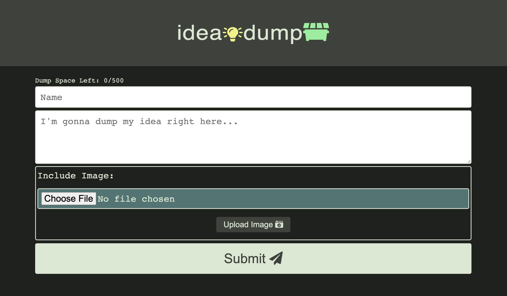

# Idea Dump App

## Deployed Application 

[Idea Dump App](http://3.131.94.211/)

## Description

This full-stack application, built with a Node.js back-end and React front-end (deployed using AWS), allows a user to write short posts ('ideas') and optional images for others to view. 

When the user navigates to the homepage, a list of all posts are retrieved and rendered for the user. The user can post an 'idea' of 500 characters or less as well as an image. When the user clicks on any user's name, a profile page will be rendered which displays all the posts of that particular user.

This application uses an Amazon Web Services S3 Bucket to save images and AWS DynamoDB to store post data. It is deployed to an Amazon EC2 instance (Ubuntu platform/NGINX server).

## Features

* Node.js back-end
* React front-end
* DynamoDB/S3 used for storage
* Amazon EC2 Instance (Ubuntu)
* NGINX Server
* CSS Flexbox

## Contact

Michael Hanson
* michaeledwardhanson@gmail.com
* [GitHub](https://github.com/mhans003)
* [LinkedIn](https://www.linkedin.com/in/michaeledwardhanson/)

## License

Licensed under the [MIT License](./LICENSE.txt).